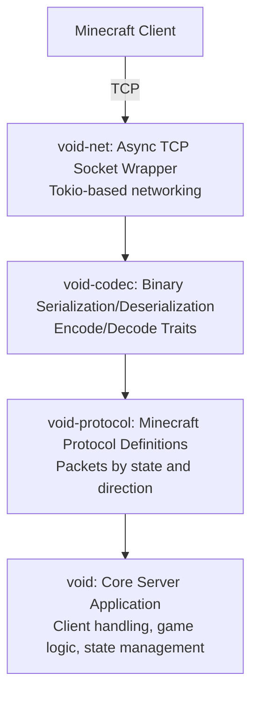

# Architecture Overview

Void is built with a modular, layered architecture that emphasizes separation of concerns and type safety.

For the full detailed architecture documentation, see the [Architecture Reference](/reference/server/architecture).

## System Architecture



## Dual-Threaded Model

Void runs on two threads:

1. **Network thread** — A Tokio multi-threaded runtime that handles TCP connections, packet I/O, and per-client async tasks.
2. **Game thread** — A Bevy ECS application that runs the game loop, processes packets, updates world state, and sends responses.

The two threads communicate exclusively through [flume](https://docs.rs/flume) channels. See the [full architecture reference](/reference/server/architecture) for channel details and the complete packet flow diagram.

## Crate Structure

| Crate | Description |
|---|---|
| **`void`** | Core server framework — ECS components, systems, handlers, commands, world generation, and the public API. |
| **`void-net`** | Low-level TCP socket abstraction (accept, read, write framed packets). |
| **`void-protocol`** | Minecraft protocol definitions — serverbound/clientbound packet enums and data types. |
| **`void-codec`** | Binary `Encode`/`Decode` traits and primitive type implementations. |
| **`void-codec-macros`** | Derive macros (`#[derive(Encode, Decode)]`) and field attributes for codec automation. |

## Connection State Machine

Minecraft connections flow through predefined states:

```
Handshake -> Status (server list ping)
          -> Login -> Configuration -> Play
```

See [Networking & Protocol](/reference/protocol/networking) for the full connection lifecycle and packet handling pipeline.

## Key Reference Pages

- [Architecture Details](/reference/server/architecture) — Dual-threaded model, tick loop, plugin system, packet flow
- [Configuration](/reference/server/configuration) — `ServerBuilder` API, `ServerConfig` fields, defaults
- [ECS Components & Resources](/reference/server/ecs) — All components, resources, and entity lifecycle
- [Events](/reference/server/events) — Semantic events, packet events, observer pattern
- [Networking & Protocol](/reference/protocol/networking) — Protocol states, connection lifecycle, keep-alive
- [Command System](/reference/gameplay/commands) — `CommandBuilder`, argument parsers, flags, default commands
- [World & Chunks](/reference/gameplay/world) — Chunk system, dimensions, streaming, world generators
- [Player Management](/reference/gameplay/players) — Join/quit flow, visibility, position broadcasting
- [Binary Codec](/reference/protocol/codec) — `Encode`/`Decode` traits, derive macros, field attributes
- [Registry System](/reference/gameplay/registry) — `RegistryDataStore` API, default registries, customization
