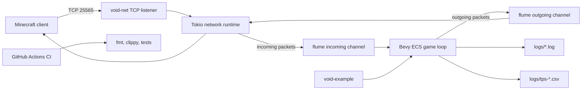

# Deployment

VoidMC is currently deployed as a Rust binary. The primary runnable artifact is the example server in `void-example/`, which demonstrates the framework, logging setup, metrics switches, and plugin registration.

## Runtime View



## Development Run

```bash
cargo run -p voidmc-example
```

Defaults:

| Setting | Default |
|---|---|
| Bind address | `127.0.0.1:25565` |
| Tick rate | `20` TPS |
| Logs | `logs/void-<timestamp>.log` |
| Spawn chunks | Configured by `void-example` with a reduced radius for faster startup |

## Release Run

```bash
cargo build --release -p voidmc-example
./target/release/voidmc-example
```

The release build is the recommended binary for manual demos and performance checks. Run it from the repository root if you want logs and metrics to appear under the project-local `logs/` directory.

## Diagnostics and Metrics

| Environment variable | Effect |
|---|---|
| `RUST_LOG=info` | Default structured logging level. |
| `RUST_LOG=voidmc::network=debug` | Focus network logs. |
| `VOID_METRICS_DEBUG=1` | Enable TPS metrics plugin. |
| `VOID_TPS_OUTPUT=logs/tps-demo.csv` | Write TPS samples to a chosen CSV file. |
| `VOID_METRICS_MODE=flame` | Enable tracing-flame output. |
| `VOID_FLAME_OUTPUT=logs/trace.folded` | Choose flame trace output path. |
| `VOID_PACKET_DEBUG=1` | Enable packet-level debug directive in the example server. |

Example:

```bash
VOID_METRICS_DEBUG=1 VOID_TPS_OUTPUT=logs/tps-demo.csv cargo run -p voidmc-example
```

## Production Caveats

VoidMC is not yet a turnkey production server. Before exposing it publicly, the project still needs hardening work around authentication/encryption, rate limiting, persistence guarantees, configuration files, and deployment automation.

For the EIP objective, this page provides a reproducible deployment path and documents current operating assumptions honestly.

