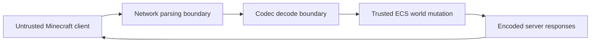

# Security and Reliability

This page documents the current security posture honestly. VoidMC has reliability mechanisms suitable for a student framework prototype, but it is not yet a production-hardened public Minecraft server.

## Trust Boundaries

The main trust boundary is between untrusted TCP input and decoded packet events. Network data must be decoded into typed protocol packets before it can affect ECS state.

## Current Reliability Mechanisms

| Mechanism | Evidence | Purpose |
|---|---|---|
| Strong Rust typing | Workspace crates | Reduces memory-safety and protocol-shape mistakes. |
| Typed codec errors | `void-codec` | Rejects invalid lengths, packet IDs, EOF, and malformed VarInts. |
| Packet ingest cap | `max_packets_per_tick` | Prevents one tick from draining unbounded packet volume. |
| Packet ingest time budget | `packet_ingest_budget_ms` | Limits time spent on network ingestion per tick. |
| Chunk generation cap | `max_chunk_generations_per_tick` | Reduces tick spikes during chunk streaming. |
| Slow tick warning | `slow_tick_ms` | Emits warnings when the game loop exceeds the configured threshold. |
| Structured logging | `tracing` setup in `void-example` | Keeps diagnostics searchable and file-backed. |
| Tests and CI | GitHub Actions | Blocks formatting, lint, and regression failures. |

## Current Limitations

| Area | Current state |
|---|---|
| Online-mode authentication | Not production-hardened yet. Public deployment should not assume Mojang session enforcement is complete. |
| Encryption/compression | Not treated as a complete production security layer yet. |
| Abuse protection | Packet and tick budgets exist, but full rate limiting, bans, and IP-level protections are future work. |
| Persistence/backups | World mutation exists in memory; backup/restore guarantees are not yet a complete operational feature. |
| Deployment isolation | No Dockerfile or service unit is currently required by the project; release binaries are run directly. |

## Hardening Roadmap

- Add explicit authentication/encryption status to the public protocol docs.
- Add configurable connection limits and rate limiting.
- Add persistence/backups for modified world state before claiming production durability.
- Add deployment automation only after runtime configuration stabilizes.
- Add resilience tests for malformed packets, disconnect storms, and slow chunk generation.

## Operational Guidance

- Bind to `127.0.0.1` for local development.
- Use release builds for demos and performance measurements.
- Keep `logs/` out of version control.
- Enable TPS output during review sessions when demonstrating reliability work.
- Treat public internet exposure as experimental until the hardening roadmap is complete.

