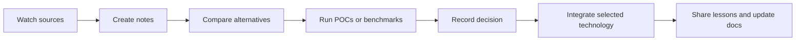

# Technology Watch Process

VoidMC uses technology watch as an engineering input, not as a list of trendy tools. The goal is to identify changes in the Rust, Minecraft protocol, async networking, ECS, observability, and AI-assisted development ecosystems that can improve the server or reduce project risk.

## Workflow

## Cadence

| Activity | Frequency | Output |
|---|---:|---|
| Protocol and dependency watch | Weekly during active development | Notes, changelog entries, protocol diffs |
| Comparative evaluation | Before a structural choice | Technology evaluation page or decision-log entry |
| POC or benchmark | Before adopting risky infrastructure | Benchmark result or experiment note |
| Integration review | After adoption | Architecture/docs update and impact summary |

## Evaluation Criteria

Every major technology choice is evaluated with the same criteria:

| Criterion | What we check |
|---|---|
| Project fit | Compatibility with a modular Minecraft server and the dual-threaded runtime |
| Performance | Impact on latency, throughput, memory, and tick stability |
| Maintainability | API clarity, documentation quality, testability, and long-term ecosystem support |
| Safety | Failure modes, type-safety, concurrency model, and misuse resistance |
| Learning cost | Complexity for new contributors and maintainers |
| Exit cost | Difficulty of replacing the technology if project needs change |

## Current Evidence

- Comparative analysis lives in [Technology Evaluations](/architecture/technology-evaluations).
- Watched sources are tracked in [Sources](./sources).
- Decisions are summarized in [Decision Log](./decision-log).
- POCs and benchmarks are documented in [Experiments](./experiments).
- Final project impact is mapped in [Integration Impact](./integration-impact).
- The school rubric mapping is in [Requirement Checklist](./requirement-checklist).

