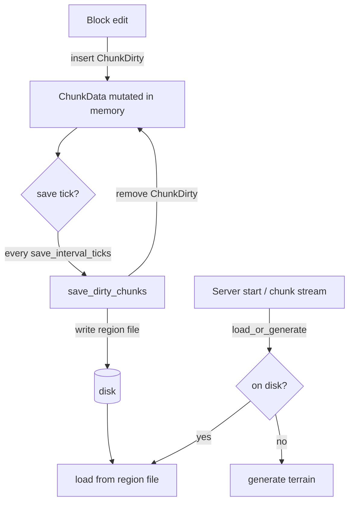

# World Serialization

VoidMC can persist modified chunks to disk and reload them on startup. This is
provided by the **`voidmc-world-io`** crate as an opt-in plugin, so the core
engine stays free of any storage dependencies.

When enabled:

- Block edits already mark their chunk with the `ChunkDirty` component. A save
  system periodically writes every dirty chunk to disk and clears the marker.
- On startup (and whenever a chunk is streamed for the first time) the engine
  loads the chunk from disk **before** falling back to the world generator.
- On shutdown — `/stop`, Ctrl-C, or SIGTERM, all of which emit `AppExit` — every
  remaining dirty chunk is flushed before the server exits.

## Enabling persistence

Add the dependency and install `WorldPersistencePlugin` via `add_plugin`:

```toml
# Cargo.toml
voidmc-world-io = { version = "0.1.0", path = "../void-world-io" }
```

```rust
use voidmc::{ServerConfigBuilder, VoidServer};
use voidmc_world_io::{PersistenceConfig, WorldPersistencePlugin};

VoidServer::new(ServerConfigBuilder::new().build())
    .add_plugin(|app| {
        app.add_plugins(WorldPersistencePlugin::new(
            PersistenceConfig::new("world").save_interval_ticks(200),
        ));
    })
    .run();
```

The plugin must be added before the server runs (the example above does this via
`add_plugin`), so the chunk loader is installed before the spawn area is
generated.

## Configuration

`PersistenceConfig` controls where and how chunks are stored:

| Field | Type | Default | Description |
|---|---|---|---|
| `directory` | `PathBuf` | `"world"` | Root world directory; region files live under `<dir>/region/` |
| `save_interval_ticks` | `u64` | `200` | Ticks between periodic flushes of dirty chunks |
| `enabled` | `bool` | `true` | Master switch; when `false` the plugin installs nothing |
| `regenerate_light_on_load` | `bool` | `false` | Skip persisting light and regenerate full sky light on load (smaller files) |
| `max_saves_per_flush` | `usize` | `0` | Cap chunks written per save tick (`0` = unlimited) |

Builder-style setters are available:

```rust
PersistenceConfig::new("world")
    .save_interval_ticks(400)
    .regenerate_light_on_load(true)
    .max_saves_per_flush(64);
```

## On-disk format

Chunks are grouped into **region files** at
`<directory>/region/<dimension>/r.<rx>.<rz>.vrm`, where `rx = chunk_x >> 5` and
`rz = chunk_z >> 5` (32×32 chunks per file). The layout is modeled on
Minecraft's Anvil `.mca` format but is **not** vanilla-compatible:

- A two-sector (8 KiB) header holds 1024 location entries
  (`offset << 8 | sector_count`) and 1024 timestamps.
- Each chunk payload is `[u32 length][u8 compression][zlib data]`, padded to a
  4096-byte sector boundary.
- The payload is a standard (named-root) NBT compound built with `ussr_nbt`,
  mirroring VoidMC's chunk types: per-section `block_count`, `block_states`
  (single value or `bits` + `palette` + packed `data`), `biome`, plus
  `heightmaps` and (optionally) `light`.

## Lifecycle



The `ChunkDirty` marker is removed only after a **successful** write, so a failed
save is retried on the next interval. Loaded chunks are inserted exactly like
generated ones and are not marked dirty (they already match disk).

## Custom storage backends

`WorldPersistencePlugin::new` uses the built-in region-file store. To plug in a
different backend (database, object store, test double), implement
[`ChunkStore`](#) and pass it explicitly:

```rust
use std::sync::Arc;
use voidmc_world_io::{ChunkStore, PersistenceConfig, WorldPersistencePlugin};

let store: Arc<dyn ChunkStore> = Arc::new(MyStore::new());
app.add_plugins(WorldPersistencePlugin::with_store(
    PersistenceConfig::new("world"),
    store,
));
```

The engine-facing hook is the `voidmc::ChunkLoader` trait (with the
`ChunkLoaderResource` it is installed as); `voidmc-world-io` provides a
`StoreLoader` adapter that bridges any `ChunkStore` to it.

## Limitations

- The format is **not** compatible with the vanilla Minecraft client or other
  servers; it only round-trips VoidMC's own chunk data.
- Persistence is chunk-granular: a chunk is saved as a whole when any block in
  it changes. Entities and block entities are not yet persisted.
- A chunk modified in memory but never flushed (e.g. on a hard `kill -9`) may be
  lost; periodic and shutdown flushes cover the normal cases.

## See also

- [Chunk protocol spec](/reference/protocol-specs/v26.1.2/chunks)
- [Server configuration](/reference/server/configuration)
- [ECS components & resources](/reference/server/ecs)
